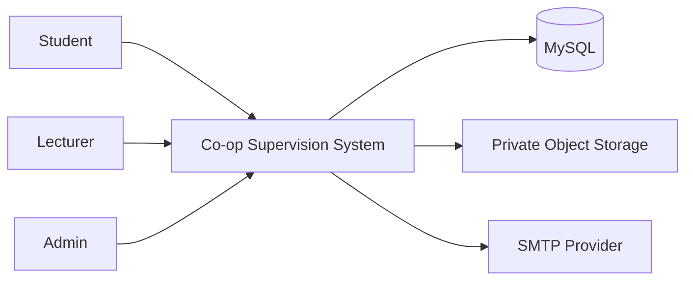
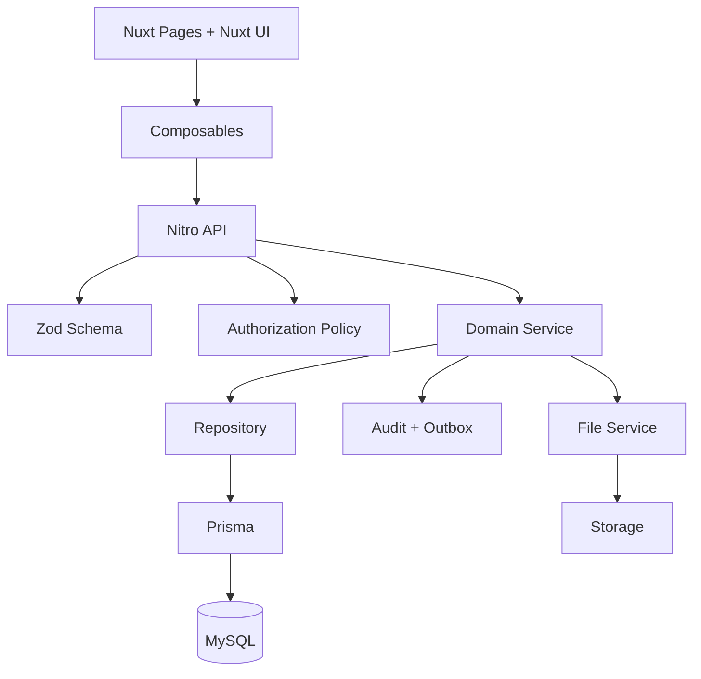
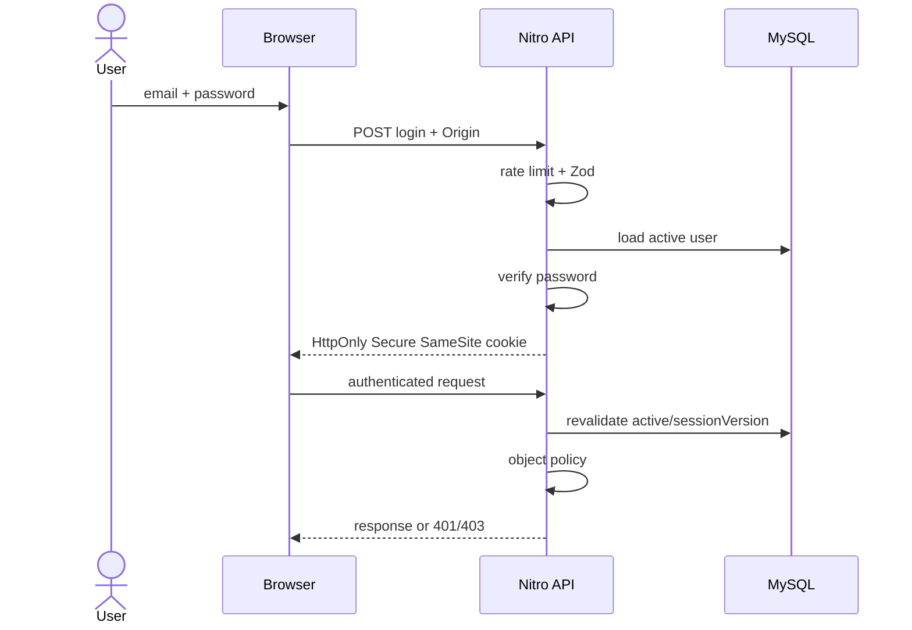
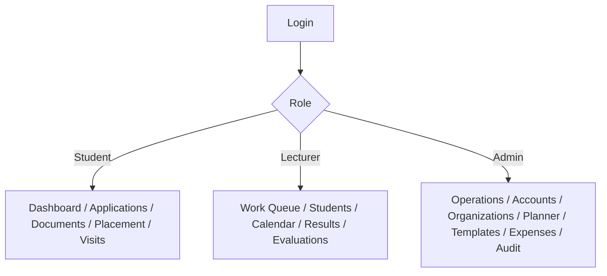
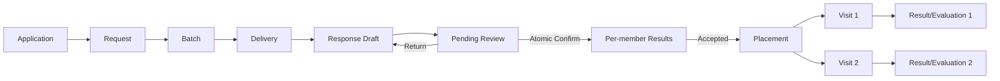
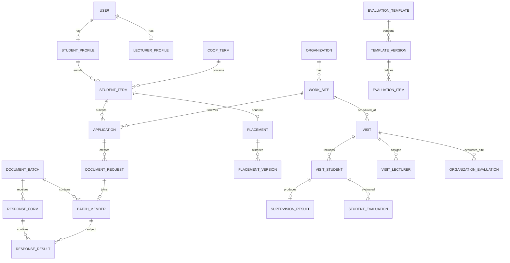
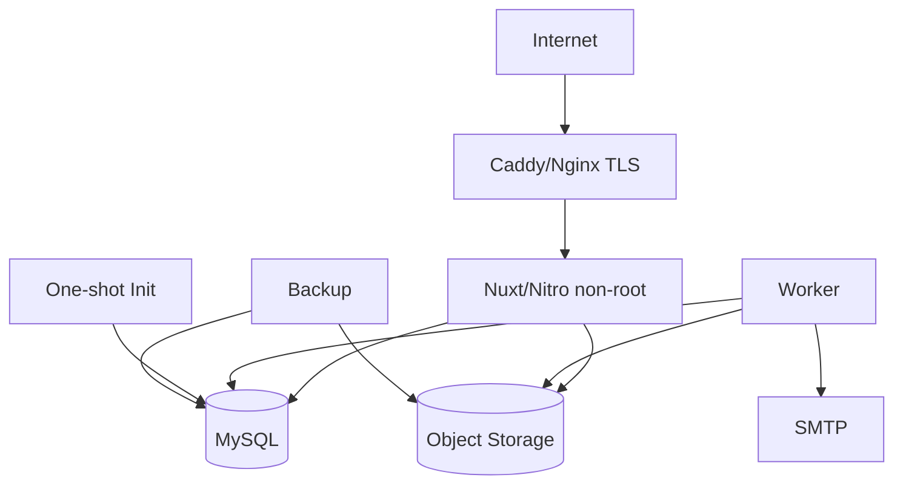

# แผนแม่บทระบบจัดการการนิเทศสหกิจศึกษา

> สถานะ: Architecture and Planning Proposal — ยังไม่อนุมัติให้เริ่ม Feature Implementation
> เอกสารนี้รวม Requirement, Project Plan, Architecture, Database, UX/UI, Security, Operations, Testing และ Traceability ไว้เป็นแหล่งอ้างอิงหลักฉบับเดียว

## 1. Executive Summary

พัฒนาระบบเว็บกลางสำหรับบริหารสหกิจศึกษาตั้งแต่นักศึกษาบันทึกการสมัคร ขอและส่งหนังสือ รับแบบตอบรับ ยืนยันสถานที่ฝึกงาน วางแผนและบันทึกผลนิเทศสองรอบ ประเมินนักศึกษาและสถานประกอบการ เก็บ Requirement ค่าใช้จ่าย รายงาน การแจ้งเตือน และ Audit Log

แนวทางที่เล็กที่สุดซึ่งรองรับ Requirement คือ Nuxt 4 Modular Monolith หนึ่ง codebase ประกอบด้วย Vue UI, Nitro API, worker process, MySQL และ private object storage ไม่ใช้ Microservices, Redis หรือ distributed transaction จนกว่าจะมีหลักฐานด้านปริมาณงาน

รุ่นแรกยังจัดทำหนังสือราชการภายนอกระบบแล้วอัปโหลดไฟล์กลับเข้ามา ไม่สร้าง PDF ราชการอัตโนมัติ

## 2. Problem Statement

ข้อมูลเดิมมีหลายระดับและหลายเจ้าของ เช่น คำขอออกหนังสือเป็นรายนักศึกษา แต่หนังสือและแบบตอบรับเป็นรายชุด การนิเทศหนึ่งรายการมีหลาย Student/Lecturer แต่ผลและการประเมินบางส่วนเป็นรายคน หากเก็บใน record เดียวจะเกิดข้อมูลซ้ำ สิทธิ์รั่ว ประวัติสูญหาย และ race condition เมื่อหลายคนดำเนินการพร้อมกัน

ระบบต้องทำให้ workflow เป็น explicit command, ตรวจสิทธิ์และ business rule ฝั่ง Server, ใช้ transaction กับงานหลายขั้นตอน และใช้ Database constraint เป็น final guard

## 3. Goals และ Non-goals

### Goals

- `G-001` ทุกบทบาทเห็นสถานะล่าสุดจากข้อมูลชุดเดียวกัน
- `G-002` Workflow และ Permission ถูกบังคับฝั่ง Server และ Database
- `G-003` เอกสารและข้อมูลสำคัญตรวจสอบย้อนหลังได้
- `G-004` รองรับการนิเทศและประเมินครั้งที่ 1 และ 2
- `G-005` รองรับ CSV/XLSX import/export อย่างปลอดภัย
- `G-006` Deploy, backup, restore และทดสอบได้แบบทำซ้ำ

### Non-goals รุ่นแรก

- `NG-001` ไม่สร้างหนังสือราชการหรือ PDF อัตโนมัติ
- `NG-002` ไม่มีบัญชีหรือ portal สำหรับสถานประกอบการ
- `NG-003` ไม่มี native mobile application
- `NG-004` ไม่คำนวณอัตราเบิกค่าใช้จ่ายราชการ
- `NG-005` ไม่ใช้ Microservices, event broker หรือ Redis โดยไม่มีความจำเป็น

## 4. Confirmed Decisions, Assumptions และ Open Questions

### ยืนยันแล้ว

- `CF-001` บทบาทหลักคือ Student, Lecturer และ Admin/Officer
- `CF-002` Technology หลัก: Nuxt 4, Vue 3 Composition API, TypeScript strict, Tailwind, Nuxt UI, Lucide, Nitro, MySQL, Prisma, Zod, Docker, Vitest, Playwright, pnpm และ Node.js 22+
- `CF-003` Request รายคนแยกจาก Document Batch หลายคน
- `CF-004` Student ผู้อัปโหลด shared response กรอกผลรายคนเป็น draft; Lecturer/Admin confirm ทั้งชุดครั้งเดียว
- `CF-005` “ยังไม่ได้จัดตาราง” เป็นค่าคำนวณ ไม่ใช่ Visit status
- `CF-006` Student มี current placement หนึ่งแห่งต่อ Coop Term
- `CF-007` Evaluation Template ต้อง versioned และผลเก็บ item snapshot
- `CF-008` Response confirmation เป็น all-or-nothing ทั้ง Batch

### Assumptions ที่ย้อนกลับได้

- `AS-001` “เจ้าหน้าที่” ใช้ role `ADMIN` จนกว่าจะต้องแยก subrole
- `AS-002` MySQL 8.4 LTS, InnoDB, `utf8mb4`
- `AS-003` เก็บเวลา UTC และแสดง `Asia/Bangkok`
- `AS-004` รองรับ CSV UTF-8 with BOM และ `.xlsx`; ไม่รองรับ `.xls`
- `AS-005` In-app notification เป็น source of truth; email เป็น best effort
- `AS-006` Background jobs รุ่นแรกใช้ MySQL outbox และ worker เดียว

### Open Questions ที่กระทบ Architecture/Schema/Workflow

- `OQ-001` เลขหนังสือ unique ทั้งระบบ ต่อปี หรือต่อประเภท
- `OQ-002` ใครสร้าง ระงับ และ reset บัญชี Lecturer/initial Admin
- `OQ-003` หลังยืนยัน Placement จะ cancel Application อื่นอัตโนมัติหรือไม่
- `OQ-004` เกณฑ์ Complete Visit และนัดชดเชยเมื่อ Student บางคนขาด
- `OQ-005` คอลัมน์ Import/Export ฉบับอนุมัติ
- `OQ-006` Rubric, weight และ pass criteria ของ Evaluation Template
- `OQ-007` Student เห็นผลนิเทศและผลประเมินระดับใด
- `OQ-008` RPO, RTO และ retention ของ DB/files/audit/PII
- `OQ-009` Allowed file types, max size และ quota
- `OQ-010` ต้องแยก Officer จาก Super Admin หรือไม่
- `OQ-011` Lecturer เข้าถึงทั้งสาขา active term หรือเฉพาะ assignment
- `OQ-012` Evaluation เป็นหนึ่งฉบับร่วมต่อ Visit หรือหนึ่งฉบับต่อ Lecturer
- `OQ-013` Work Site เดียวมีหลาย Visit พร้อมกันได้หรือไม่
- `OQ-014` Session TTL, reset expiry, lockout และ bootstrap policy
- `OQ-015` Concurrent users, import/export rows, upload size, availability และ response-time target
- `OQ-016` MySQL collation ที่ผ่านการทดสอบชื่อภาษาไทยจริง

### Implementation Decisions สำหรับ Autonomous Build

คำสั่งให้ดำเนินการแบบ Autonomous ถือเป็นการอนุมัติ M0 โดยใช้ค่าเริ่มต้นที่ปลอดภัยต่อไปนี้จนกว่าเจ้าของระบบจะเปลี่ยนแปลง:

- `ID-001` เลขหนังสือ unique ต่อปีการศึกษาและประเภทเอกสาร
- `ID-002` Admin สร้าง/ระงับ/reset Lecturer; Initial Admin สร้างครั้งเดียวจาก environment แล้วบังคับเปลี่ยนรหัสผ่าน
- `ID-003` ยืนยัน Placement แล้ว Application อื่นเปลี่ยนเป็น `CANCELLED` ด้วย system reason; Batch ที่ส่งแล้วไม่ลบและต้องตรวจ conflict ตอน confirm
- `ID-004` Visit complete ได้เมื่อสมาชิกทุกคนมีผล หรือ Lecturer ระบุ absent/makeup-required รายคน
- `ID-005` Import สูงสุด 5,000 แถว; export ใหญ่ทำ async; `.csv` และ `.xlsx` เท่านั้น
- `ID-006` Evaluation เป็น official collaborative submission หนึ่งฉบับต่อ visit/subject/template
- `ID-007` Student เห็นสถานะและสรุปผลของตน แต่ไม่เห็น internal note หรือคะแนน rubric ภายใน
- `ID-008` Lecturer อ่านข้อมูล active term ทั้งสาขา แต่แก้เฉพาะ assignment; Admin override พร้อม reason
- `ID-009` Work Site เดียวรองรับหนึ่งทีมต่อ date/period
- `ID-010` Session 8 ชั่วโมง, reset token 30 นาที, login limit 5 ครั้ง/15 นาที
- `ID-011` ค่าเริ่มต้น upload 10 MiB/ไฟล์; retention/RPO/RTO เป็น deployment policy ที่ต้องยืนยันก่อน production

## 5. Stakeholders, Roles และ Permission Matrix

Stakeholders: Student, Lecturer, Admin/Officer, ผู้รับผิดชอบหลักสูตร, Infrastructure Operator และสถานประกอบการในฐานะแหล่งข้อมูลภายนอก

| Capability | Student | Lecturer | Admin |
|---|:---:|:---:|:---:|
| แก้ข้อมูลติดต่อของตน | ✓ | ✓ | ✓ |
| Import Student | — | ✓ จำกัด field | ✓ |
| Export รายชื่อ/ข้อมูลฝึกงาน | — | ✓ ตาม scope | ✓ |
| Activation/Password/Role ผู้อื่น | — | — | ✓ |
| Application | ของตน | ดู/แก้ตาม scope + audit | ทั้งหมด + audit |
| Organization merge | — | — | ✓ |
| Document request | สร้างของตน | ดำเนินการ | ดำเนินการ |
| Upload shared response | สมาชิก Batch | — | แก้ไขได้ |
| Confirm response/placement | — | ✓ | ✓ |
| Visit | ดู/รับทราบ | สร้าง/แก้ + audit | สร้าง/แก้ + audit |
| Supervision result | ตาม policy | สร้าง/แก้ + audit | ดู/ติดตาม |
| Evaluation | — | สร้าง/แก้ + audit | Template/ติดตาม |
| Requirement | — | สร้าง/ดู | ดู/รายงาน |
| Expense | — | — | ✓ |

UI navigation guard ใช้เพื่อ UX เท่านั้น ทุก API ต้องตรวจ session, active user, role และ object scope ซ้ำฝั่ง Server

## 6. Functional Requirements

### Identity และ Student Administration

- `FR-001` Admin import, preview, confirm และตรวจผล Student CSV/XLSX รายแถว
- `FR-002` Lecturer import Student ได้ แต่แก้ Role/Activation/Password ไม่ได้
- `FR-003` Admin สร้าง Activation Code, suspend/reactivate และ reset password
- `FR-004` ผู้ใช้ login/logout, เปลี่ยน password และแก้ข้อมูลติดต่อที่อนุญาต
- `FR-005` Admin/Lecturer ค้นหา กรอง และดูประวัติ Student

### Organization และ Application

- `FR-010` Student บันทึกหลาย Application พร้อม Work Site, Contact และ Evidence
- `FR-011` ระบบแนะนำ Duplicate Candidate แต่ห้าม merge อัตโนมัติ
- `FR-012` Admin preview และยืนยัน Organization/Work Site merge พร้อม history
- `FR-013` Status change/correction ทุกครั้งเก็บ actor, old/new, time และ reason
- `FR-014` Application ใช้ `CANCELLED`/Correction ห้าม hard delete ผ่าน workflow ปกติ

### Document และ Delivery

- `FR-020` Student สร้าง Document Request จาก Application ของตน
- `FR-021` Lecturer/Admin รวมหลาย Request เป็น Batch ตาม Coop Term/Work Site
- `FR-022` Batch Member เชื่อม Request/Student และเก็บ Document Snapshot
- `FR-023` Lecturer/Admin บันทึกเลข/วันที่และ upload Letter/Blank Response
- `FR-024` หลังส่งแล้วการแก้ไฟล์ต้องสร้าง Revision และเก็บไฟล์เดิม
- `FR-025` Admin เปลี่ยนผู้รับผิดชอบการส่ง Student/Lecturer
- `FR-026` ผู้รับผิดชอบบันทึกวันที่ ช่องทาง ผู้รับ หมายเหตุ และหลักฐาน

### Shared Response และ Placement

- `FR-030` สมาชิก Batch คนหนึ่ง upload response และกรอก `ACCEPTED/DECLINED` รายคนเป็น `DRAFT`
- `FR-031` Student ส่งเป็น `PENDING_REVIEW` แล้วแก้ไม่ได้จนถูกส่งกลับ
- `FR-032` Lecturer/Admin แก้เฉพาะราย ส่งกลับ หรือ confirm ทั้ง Batch
- `FR-033` ระบบเก็บ result/confirmer/time แยกราย Batch Member
- `FR-034` Accepted สร้าง Placement; Declined ปิดเส้นทางนั้น
- `FR-035` Student ดู Placement และเอกสารของตน

### Supervision และ Requirements

- `FR-040` Admin วางแผนรอบ 1/2 ด้วย filter Region→Province→Work Site→Student
- `FR-041` Visit หนึ่งรายการมี Round, Date, Period, Work Site และหลาย Student/Lecturer
- `FR-042` ระบบป้องกัน Lecturer, Student และ Work Site time conflict
- `FR-043` Student/Lecturer acknowledge Visit ของตน
- `FR-044` Reschedule/Reassign/Cancel ต้องมี reason/history/notification
- `FR-045` Lecturer บันทึกผลราย Student และ Complete Visit
- `FR-046` ระบบคำนวณ Unscheduled/Overdue/Missing-result Coverage
- `FR-047` Lecturer เก็บ Internal Note และ Structured Company Requirement

### Evaluation, Expense, Report และ Notification

- `FR-050` Admin สร้าง Version/Activate Template สำหรับ Student/Organization
- `FR-051` Lecturer Draft/Submit Evaluation แยก Visit/Round/Subject
- `FR-052` Correction หลัง Submit หรือข้าม Lecturer ต้องมี reason/version
- `FR-053` Admin บันทึก Expense แยกรอบ; total = travel+lodging+meal
- `FR-054` Lecturer/Admin Export CSV/XLSX ตาม filter และ permission
- `FR-055` ระบบสร้าง In-app Notification และ Email Outbox จาก Domain Event
- `FR-056` List รองรับ Server Search, Filter, Sort และ Pagination

## 7. Business Rules และ State Transitions

- `BR-001` Placement ปัจจุบัน unique ต่อ Student/Coop Term
- `BR-002` Batch อยู่ใน Term/Work Site เดียว
- `BR-003` Student ห้ามอยู่ Active Batch ซ้ำใน Term/Work Site เดียว
- `BR-004` Response File อยู่ระดับ Batch; Result อยู่ระดับ Batch Member
- `BR-005` Response Confirmation และ Placement Creation อยู่ Transaction เดียว
- `BR-006` Response Confirm เป็น All-or-nothing ทั้ง Batch; Conflict ใด ๆ Rollback ทั้งชุดและคืน 409
- `BR-007` Unscheduled Coverage เป็น Projection ไม่มี Placeholder Visit
- `BR-008` Student มี Active Visit ไม่เกินหนึ่งรายการต่อ Round
- `BR-009` Lecturer/Student/Work Site ห้ามชน Date/Period ตาม Policy
- `BR-010` Evaluation unique ต่อ Visit+Subject+Template
- `BR-011` Published Template immutable; Submitted Result เก็บ Item Snapshot
- `BR-012` Confirmed/Submitted/Cross-owner Correction ต้องมี Reason/Audit
- `BR-013` Expense เก็บจำนวนวันและยอด Decimal, เพิ่มได้หลายรายการต่อ Visit/Round และเห็นเฉพาะ Admin
- `BR-014` ข้อมูลสำคัญใช้ Cancel/Reverse/Correction ไม่ลบ History

```text
Application: SUBMITTED ↔ WAITING_RESPONSE ↔ INTERVIEW_PENDING ↔ PRELIMINARY_ACCEPTED
             └→ REJECTED | CANCELLED
Request:     REQUESTED → IN_PROGRESS → READY_TO_SEND
Batch:       DRAFT → READY_TO_SEND → SENT → CLOSED
Delivery:    ASSIGNED → SENT → WAITING_RESPONSE → RESPONSE_RECEIVED
Response:    DRAFT → PENDING_REVIEW → CONFIRMED
                         └──────────→ DRAFT
Visit:       SCHEDULED → COMPLETED
                └→ POSTPONED → SCHEDULED | CANCELLED
Evaluation: DRAFT → SUBMITTED; Correction ใช้ Version Record
```

## 8. Validation, Error และ Recovery

- `VAL-001` Params/Query/Body ทุก Endpoint ผ่าน Zod Strict Schema
- `VAL-002` Normalize Student Code, Enum, Unicode และ Date ที่ Boundary
- `VAL-003` File ตรวจ Extension, MIME, Magic Byte, Size และ Scan
- `VAL-004` Import Preview แยก NEW/UNCHANGED/CONFLICT/INVALID
- `VAL-005` Evaluation Required Items และ Score Range ต้องครบ
- `VAL-006` Date/Period/Round/Membership ต้องสอดคล้องกัน

Error contract: `400` malformed, `401` no session, `403` forbidden, `404` missing/hidden, `409` state/concurrency, `422` semantic validation, `429` rate limit, `503` dependency unavailable พร้อม `{code,message,fieldErrors?,correlationId}`

Email failure ไม่ rollback Business Transaction; Worker retry จาก Outbox Transaction failure ต้อง rollback ทั้งชุดและ Idempotency Key ช่วย retry อย่างปลอดภัย

## 9. Non-functional, Security และ Privacy

- `NFR-001` Responsive Mobile/Tablet/Desktop และ Light/Dark
- `NFR-002` Server Pagination 10/20/50/100 และ Deterministic Default Sort
- `NFR-003` Loading/Empty/Error/Retry และ Action Failure ที่อธิบายได้
- `NFR-004` รองรับภาษาไทย/Noto Sans Thai และ CSV/XLSX ไม่เพี้ยน
- `NFR-005` Health และ Readiness แยกกัน
- `NFR-006` Structured Log มี Correlation ID โดยไม่เก็บ Secret
- `SEC-001` ทุก API บังคับ Session/Policy ฝั่ง Server
- `SEC-002` Secure Password Hash, HttpOnly/Secure/SameSite Cookie, Expiry/Revocation
- `SEC-003` Login Rate Limit, Origin/CSRF, CSP, HSTS และ Security Headers
- `SEC-004` Input ใช้ Zod และ Request/Parser Resource Limit
- `SEC-005` Upload ตรวจ MIME/Magic/Size/Scan และ Random Object Key
- `SEC-006` Private File ใช้ Authorized Short-lived Signed URL
- `SEC-007` CSV Export Neutralize Cell ที่ขึ้นต้น `=`, `+`, `-`, `@`
- `SEC-008` Audit ห้ามมี Password/Hash/Token/File Body และ Runtime แก้/ลบไม่ได้
- `SEC-009` DB/Storage User ใช้ Least Privilege; Secret อยู่นอก Source Code

## 10. UX/UI Design System

- Teal primary, Slate neutral, Light/Dark ใน `app/app.config.ts`
- Nuxt UI และ Lucide Icons; Noto Sans Thai
- Desktop Fixed Sidebar; Mobile Top Bar + Slide-in Drawer
- Controls สูงประมาณ 44px; Form เริ่ม 1 Column และ 2 Columns บนจอใหญ่
- Focus visible, keyboard navigation และเป้าหมาย WCAG AA
- Table มี Debounced Instant Search, Refresh, Filter Wrap และ URL Query State
- Sort สามสถานะ Default→Ascending→Descending→Default; Default ต้องลบ Sort Query และใช้ Server Order จริง
- Mobile Horizontal Scroll; Action Column Compact และ Wrap เมื่อเกินสอง Action
- ห้าม Disable Action Button; Handler ตรวจเงื่อนไขและ Toast โดยไม่เรียก API เมื่อไม่ผ่าน
- Important Mutation ต้องมี Confirmation หรือ Reason

## 11. Architecture

### System Context



### Component และ Dependency Direction



Dependency rule: Page/Component→Composable→API→Zod/Policy→Service→Repository→Prisma→MySQL `shared` ห้าม import `server`; UI ห้ามเรียก Prisma; Business Rule ห้ามกระจายใน API Handler

### Project Structure

```text
app/{components,composables,layouts,middleware,pages,assets/css}
server/{api,middleware,services,repositories,utils,domain,policies,jobs}
shared/{schemas,types,constants}
prisma/{schema.prisma,migrations,seed.ts}
tests/{unit,integration,e2e}
scripts/ docs/
```

### Authentication Sequence



### Navigation



### Business Workflow



## 12. Technology Stack

| Layer | Technology |
|---|---|
| Runtime/Package | Node.js 22+ LTS, pnpm |
| Web/API | Nuxt 4, Vue 3 Composition API, TypeScript strict, Nitro |
| UI | Tailwind CSS, Nuxt UI, Lucide, Noto Sans Thai |
| Data | MySQL 8.4 LTS/InnoDB/utf8mb4, Prisma/Migrate |
| Validation/Auth | Zod, `nuxt-auth-utils` proposal, Server Policies |
| Files | MinIO local; S3-compatible private storage production |
| Spreadsheet | SheetJS for XLSX; safe CSV parser/writer |
| Email/Jobs | SMTP, Mailpit local, MySQL Outbox Worker |
| Testing | Vitest (Node environment), Playwright |
| Operations | Docker Multi-stage, Compose, Caddy/Nginx, Pino, optional Sentry/OpenTelemetry |

Pinia, Redis และ BullMQ เป็น Optional Upgrade เท่านั้น

## 13. Database Design

### Conventions

- PK ใช้ UUID/ULID Strategy เดียวกัน; FK ใช้ `RESTRICT` เป็นค่าเริ่มต้น
- ทุก Master/Transaction มี `createdAt`, `updatedAt`; actor fields เมื่อจำเป็น
- Money ใช้ `DECIMAL(12,2)`; timestamps UTC; ไม่ใช้ Float สำหรับคะแนน/เงิน
- Stable closed states ใช้ Prisma Enum; editable categories ใช้ Lookup Table
- Prisma Migrate ใช้ Expand→Backfill→Constraint→Contract และ Production ใช้ `migrate deploy`

### Entity Groups

- Identity: `users`, profiles, activation/reset/session, coop terms/enrollments
- Organization: organizations, work sites, contacts, aliases, merge history
- Application: applications, status history, evidence
- Document: requests, batches, members, versions, deliveries/history/evidence
- Response: response forms และ results อ้าง Batch Member
- Placement: one current row per StudentTerm + placement versions
- Supervision: visits, members, active slot reservations, results/history/notes/requirements
- Evaluation: templates, immutable versions/items, separate Student/Organization submissions/answers/versions
- Operations: files/versions, import/export jobs, notifications/outbox, expenses, audit

### Table Dictionary และ Referential Integrity

ทุกตารางธุรกรรมใช้ `id`, `createdAt`, `updatedAt` และ actor field ตามความรับผิดชอบ ตารางต่อไปนี้เป็น baseline สำหรับ Prisma Schema; field ที่เป็นความลับเก็บเฉพาะ hash และไม่บันทึกลง Audit

| Table/กลุ่ม | Key fields และความสัมพันธ์ | Constraint/Index สำคัญ |
|---|---|---|
| `users` | email, normalizedEmail, role, status, passwordHash, sessionVersion | required unique normalized email; index role/status |
| `activation_codes`, `password_reset_tokens` | userId, tokenHash, expiresAt, usedAt/revokedAt | unique tokenHash; index userId+expiresAt; token ใช้ครั้งเดียว |
| `user_sessions` | userId, sessionHash, expiresAt, revokedAt | unique sessionHash; index userId+revokedAt+expiresAt |
| `student_profiles`, `lecturer_profiles` | userId; studentCode | unique userId; unique studentCode |
| `coop_terms`, `student_term_enrollments` | academicYear, semester; studentId+coopTermId | unique term key; unique student+term |
| `organizations`, `work_sites`, `organization_contacts` | workSite.organizationId | FK `RESTRICT`; index normalized name/province |
| `organization_aliases`, `organization_merge_history` | source/target organization, actor, reason, snapshot | alias unique ใน normalization scope; history append-only |
| `applications`, `application_status_history` | studentTermId, workSiteId, status | index studentTerm+status และ workSite+status+appliedAt |
| `application_evidence_files` | applicationId, fileVersionId, visibility | unique application+fileVersion; policy ตรวจ owner/role |
| `document_requests` | studentTermId, applicationId, coopTermId, workSiteId, status | composite parent key; index term+site+status |
| `document_batches` | coopTermId, workSiteId, status, documentNo | documentNo uniqueness รอ OQ-001; index term+site+status |
| `document_batch_members` | batchId, requestId, studentTermId, coopTermId, workSiteId | unique requestId และ batchId+studentTermId; composite FK บังคับ term/site ตรงกัน |
| `document_versions` | batchId, revision, fileVersionId | unique batch+revision; ส่งแล้วแก้ด้วย revision ใหม่ |
| `deliveries`, `delivery_history`, `delivery_evidence_files` | batchId, owner, status, actor/time/evidence | `ASSIGNED→SENT`; history append-only; unique evidence relation |
| `response_forms` | batchId, revision, fileVersionId, status, lockVersion | unique batch+revision; optimistic conditional update |
| `response_student_results` | responseFormId, batchMemberId, result, confirmedBy/At | unique responseForm+batchMember; FK ป้องกันคนนอก batch |
| `placements` | studentTermId, currentWorkSiteId, sourceResponseResultId, status, version | unique studentTermId และ sourceResponseResultId |
| `placement_versions` | placementId, version, snapshot, reason, actor | unique placement+version; append-only |
| `supervision_visits` | coopTermId, workSiteId, round, date, period, status | index term+round+date+period+status |
| `visit_students`, `visit_lecturers` | visitId+subjectId | unique visit+student / visit+lecturer |
| `visit_*_slots` | visitId และ conflict key | unique keys ตาม Active Visit Reservation ด้านล่าง |
| `supervision_results`, `supervision_visit_history` | visitStudentId, result/version, actor/reason | unique official result ตาม visit student; history append-only |
| `internal_notes`, `company_requirements` | visitId/placementId, authorId, visibility/category | index subject+createdAt; policy บังคับ visibility |
| `evaluation_templates`, `evaluation_template_versions` | templateId, version, status, contentHash | unique template+version; published version immutable |
| `evaluation_items` | templateVersionId, code, answerType, maxScore, weight | unique version+code; Decimal score/weight |
| `student_evaluations`, `organization_evaluations` | visit/subject/templateVersion/status | unique official submission ตาม BR-010 และ OQ-012 |
| `evaluation_answers`, `evaluation_versions` | submissionId, item snapshot/value; correction snapshot | FK ชัดเจน ไม่ใช้ polymorphic ownerId; version append-only |
| `files`, `file_versions` | private objectKey, checksum, MIME, scanStatus, revision | unique objectKey/checksum ตาม policy; index scanStatus/createdAt |
| `import_jobs`, `import_rows` | owner, checksum, status; jobId+rowNo, normalized hash | unique job+rowNo; confirm idempotent และ conflict ไม่ overwrite |
| `export_jobs` | requesterId, filter snapshot, status, expiresAt, fileVersionId | index requester+status+createdAt และ expiresAt |
| `notifications`, `outbox_messages` | recipient/event; dedupeKey/status/nextAttemptAt | unique dedupeKey; worker index status+nextAttemptAt |
| `expenses` | visitId/round, travelDays, travel/lodging/meal Decimal, actor | หลายรายการต่อ visit/round; non-negative check; index visit/round |
| `audit_logs` | actor, action, entityType/id, requestId, reason, before/after | index entity+time, actor+time, requestId; INSERT/SELECT only |

Status ที่ปิดและเสถียรใช้ Enum; ประเภทที่ Admin แก้ได้ใช้ Lookup Table. FK ข้าม parent ที่ต้องรักษา Term/Work Site ใช้ Composite Candidate Key/FK ไม่พึ่ง Service อย่างเดียว

### Active Visit Reservation

MySQL ไม่มี Partial Unique Index จึงใช้:

- `visit_student_slots`: unique Student+Round และ Student+Date+Period
- `visit_lecturer_slots`: unique Lecturer+Date+Period
- `visit_work_site_slots`: unique WorkSite+Date+Period จนกว่า OQ-013 เปลี่ยนกติกา

Schedule/Reschedule/Cancel ต้องแก้ Visit และ Slot ใน Transaction เดียว Cancel/Postpone ปล่อย Slot แต่เก็บ Visit History

### ER Diagram



### Transaction Boundaries

1. Import Confirm ต่อ Bounded Chunk
2. Organization Merge/Repoint/History
3. Create/Move Batch Member
4. Response Confirm→Results→Placements→Audit/Outbox แบบ All-or-nothing
5. Schedule/Reschedule/Cancel Visit→Reservation Slots→History/Outbox
6. Evaluation Submit/Correction→Answers/Snapshot/Version/Audit
7. Document/File Revision Metadata

External Call, File Parsing และ SMTP ห้ามอยู่ใน Database Transaction

### Concurrency และ Idempotency

- คำสั่งสำคัญรับ `Idempotency-Key` หรือ business dedupe key และคืนผลเดิมเมื่อ retry สำเร็จแล้ว
- ใช้ `SELECT ... FOR UPDATE`, conditional update ด้วย status/version และ DB unique constraint ตาม aggregate
- Duplicate placement/slot/member แปลงเป็น `409 CONFLICT`; ห้ามตรวจใน UI แล้วถือว่าสำเร็จ
- Import confirm ทำเป็น bounded chunks; แต่ละ row เปรียบเทียบ normalized payload hash/observed version จาก preview
- Response confirmation lock form และ member snapshot, ตรวจผลครบทุก member แล้ว commit/rollback ทั้ง batch

## 14. API และ Business Logic Contract

API ใช้ REST resource สำหรับ CRUD ที่ไม่เปลี่ยน workflow และใช้ command endpoint สำหรับ state transition ห้าม Generic PATCH เปลี่ยน status โดยตรง

| Workflow | Endpoint proposal | Permission/Transaction/Audit |
|---|---|---|
| Session | `POST /api/auth/login`, `POST /api/auth/logout`, `GET /api/auth/session` | rate limit, Origin, active-user recheck, session rotation/revoke |
| Account activation/reset | `POST /api/auth/activate`, `POST /api/auth/reset-password` | hashed one-time token, expiry, revoke sessions, audit |
| Student import | `POST /api/imports/students`, `GET /api/imports/:id/preview`, `POST /api/imports/:id/confirm` | Admin/Lecturer; bounded transactions; idempotent |
| Export | `POST /api/exports`, `GET /api/exports/:id`, `GET /api/exports/:id/download` | permission-scoped query; reauthorize download; expiry |
| Applications | resource endpoints + `POST /api/applications/:id/transition`, `/cancel`, `/correct` | owner/object policy; transition matrix; history |
| Organization merge | `POST /api/organizations/:id/merge-preview`, `/merge` | Admin; one transaction; reason+history |
| Document request/batch | resource endpoints + `/add-member`, `/remove-member`, `/mark-ready`, `/send` | membership/term/site invariant; revision/history |
| Delivery | `POST /api/document-batches/:id/delivery-assignment`, `POST /api/deliveries/:id/send`, `/acknowledge`, `/assign-owner` | staff assign/reassign; assigned owner records sent time/channel/evidence; transaction+audit+outbox |
| Shared response | `POST /api/document-batches/:id/responses`, `PUT /api/responses/:id/draft-results`, `POST /api/responses/:id/submit-review`, `/return`, `/confirm` | member upload/draft; Lecturer/Admin review; confirm atomic |
| Placement correction | `POST /api/placements/:id/correct`, `/reverse` | Lecturer/Admin; reason; lock/version/history |
| Visit | resource read + `POST /api/visits`, `/reschedule`, `/postpone`, `/cancel`, `/complete` | slot transaction; reason/history/outbox |
| Result/requirements | `PUT /api/visits/:id/student-results/:studentId`, command correction endpoints | Lecturer/Admin; object policy; audit/history |
| Evaluation | template version/publish endpoints; evaluation draft + `/submit`, `/correct` | published immutable; snapshot; transaction |
| Expense | `POST /api/expenses`, `POST /api/expenses/:id/correct` | create-only supports multiple items; correction keeps visit/round immutable; Decimal+travelDays; Admin-only |

ทุก endpoint ระบุใน Implementation Spec ต่อไป: Authentication, object permission, Zod request/response schema, precondition, transaction, audit/event, error status, concurrency behavior และ idempotency. ลำดับบังคับคือ Browser/Page → Nitro API → Zod → Policy → Domain Service → Repository → Prisma → MySQL

## 15. File, Import/Export และ Audit

File state: `UPLOADED → PENDING_SCAN → CLEAN | REJECTED`; ห้าม Preview/Download ก่อน `CLEAN` ตรวจ Extension+MIME+Magic Byte, ZIP/XLSX uncompressed/cell/row limits, random key, sanitized filename และ short-lived signed URL

Import: Upload→Scan→Parse/Normalize→Preview→Confirm ใช้ payload hash/observed version จับ stale preview และ bounded chunk ห้าม overwrite conflict โดยปริยาย

Export: Server query จาก policy scope, neutralize CSV formula, async เมื่อเกิน threshold, private file+expiry และ reauthorize ตอน download

Audit แยกจาก Technical Log; เก็บ actor/action/entity/requestId/reason/before/after/time โดย allowlist field และ runtime ไม่มี update/delete privilege

## 16. Notification และ External Integration

- `NTF-001` Document ready, delivery overdue, response uploaded, placement confirmed
- `NTF-002` Visit assigned/changed/due, result/evaluation missing
- In-app Notification สร้างพร้อม Business Transaction
- Email Outbox มี Dedupe Key, Retry, Attempts และ Last Error
- SMTP failure ไม่กระทบข้อมูลหลัก
- S3-compatible storage เป็น External Integration สำหรับ Private Files

## 17. Docker, Deployment และ Backup



Docker Multi-stage: dependencies→build→initializer/migration→non-root runtime Compose มี app, db, init, persistent volumes, healthcheck, backup และ restore profile Production override เพิ่ม reverse proxy/worker และ managed/private dependencies

Init ทำ `prisma migrate deploy`→Idempotent Seed→Create Initial Admin แบบ One-time ห้าม reset admin เดิม แยก Host `MYSQL_PORT` จาก Container `3306`; Container `DATABASE_URL` ใช้ hostname `db`

Backup ใช้ encrypted DB backup + object manifest/checksum + off-host copy Restore drill ตรวจ FK, file checksum, login และ representative workflow ตาม RPO/RTO ที่อนุมัติ

## 18. Testing Strategy และ Quality Gates

### Unit

Zod schemas, domain rules, transitions, normalization, file signature, score/expense calculations

### Integration

API+MySQL จริง, transaction, constraints, concurrency, rollback, idempotency, authentication/authorization

### E2E

Login/logout, role workflows, CRUD สำคัญ, list behavior, invalid-action toast, import/export, attachment, responsive และ permission

### Operations

Migration จาก Empty/Previous Schema, Docker Build, Compose Validation และ Backup/Restore Drill

ก่อนส่งงานต้องผ่าน:

```text
pnpm lint
pnpm typecheck
pnpm test
pnpm test:e2e
prisma validate
migration test
pnpm build
docker image build
docker compose config
```

ห้ามปิด Lint/Type Error เพื่อหลบปัญหา

## 19. Reports และ Data Requirements

- `DATA-001` Master: User/Profile, Term, Organization, Work Site, Contact, Template
- `DATA-002` Transaction: Application, Request, Batch, Delivery, Response, Placement, Visit, Result, Evaluation, Expense
- `DATA-003` History: Status/File/Placement/Evaluation Version และ Audit
- `RPT-001` Student Roster/Internship Status ตาม Term/Company/Province/Status
- `RPT-002` Students Without Placement
- `RPT-003` Supervision Coverage รอบ 1/2 และ Missing Result/Evaluation
- `RPT-004` Requirement Summary ตาม Category/Technology/Work Site
- `RPT-005` Admin-only Expense Summary แยกรอบ

## 20. Acceptance Criteria

- `AC-001` Student ไม่อ่าน/แก้ข้อมูลคนอื่นผ่าน UI/API/File URL
- `AC-002` Import Preview ไม่เขียน DB และ Conflict ไม่ Overwrite
- `AC-003` หลาย Request รวม Batch ได้โดยประวัติรายคนไม่หาย
- `AC-004` ไฟล์ที่ส่งแล้วแก้ได้เฉพาะ Revision ใหม่
- `AC-005` Response Confirm ครั้งเดียวสร้าง Results/Placements แบบ Atomic
- `AC-006` Concurrent Placement Confirm สำเร็จหนึ่งรายการ อีกคำขอได้ 409
- `AC-007` Unscheduled Coverage ไม่มี Placeholder Visit
- `AC-008` Visit Conflict ถูกปฏิเสธและ Cancelled Visit ไม่ขวางนัดใหม่
- `AC-009` Template Version ใหม่ไม่เปลี่ยน Submitted Result เดิม
- `AC-010` Lecturer/Student เข้าถึง Expense ไม่ได้ทุก Channel
- `AC-011` Audit สำคัญมี Actor/Before/After/Reason/Time และแก้ไม่ได้
- `AC-012` Restore Drill กู้ DB/File Reference ได้สอดคล้องกัน
- `AC-013` Login/Logout/Suspend/Reset Revoke Session ตาม Policy
- `AC-014` Organization Merge เป็น Preview+Transaction และรักษา Source History
- `AC-015` Invalid Application Transition ได้ 409 และไม่มี Hard Delete
- `AC-016` Delivery/Acknowledgment/Result/Requirement มี Actor/Time/History/Notification
- `AC-017` Outbox Retry ไม่ส่งซ้ำและ SMTP Fail ไม่ Rollback Main Transaction
- `AC-018` List ผ่าน Search/Filter/3-state Sort/Page และ Default Order จริง
- `AC-019` Export Row/Scope ตรง Filter/Permission และ CSV Safe
- `AC-020` Unsafe/Unscanned Upload ดาวน์โหลดไม่ได้
- `AC-021` Health/Readiness แยกและตรวจ Dependencies ถูกต้อง
- `AC-022` UI ผ่าน Responsive/Keyboard/Loading/Empty/Error/Retry/Toast Contract

## 21. Milestones

| Milestone | Scope | Exit Criteria |
|---|---|---|
| M0 Plan Approval | Scope/OQ/Architecture/DB | Owner approves this document |
| M1 Foundation | Repo/Auth/RBAC/DB/Audit/File/CI | Security gates+migrations pass |
| M2 Student/Application | Import/Profile/Org/Application | FR-001–014 pass |
| M3 Documents | Request/Batch/Revision/Delivery | FR-020–026 pass |
| M4 Response/Placement | Draft/Review/Confirm/Concurrency | AC-005/006 pass |
| M5 Supervision | Planner/Conflict/Result/Requirement | AC-007/008/016 pass |
| M6 Evaluation/Report | Templates/Results/Export/Expense | AC-009/010/019 pass |
| M7 Hardening/Go-live | Security/Performance/Backup/UAT | All gates+AC-012 |

## 22. Risks และ Mitigations

| Risk | Mitigation |
|---|---|
| Lecturer scope กว้าง/Privacy | ปิด OQ-011 และใช้ Object Policy |
| MySQL ไม่มี Partial Unique | Active Reservation Tables |
| DB/File ไม่สอดคล้อง | Quarantine, Metadata Transaction, Orphan Reconciliation |
| Import ข้อมูลสกปรก | Preview, Hash, Conflict Resolution, Idempotency |
| Template เปลี่ยนย้อนหลัง | Immutable Version + Snapshot |
| Email/Worker ล้มเหลว | Transactional Outbox + Dedupe/Retry |
| Seed ทับ Admin Data | Create-if-missing; Never Overwrite Edited Master |
| Restore ไม่เคยทดสอบ | Release Gate และ Scheduled Drill |
| ไม่มี NFR Sizing | ปิด OQ-015 ก่อน Performance Acceptance |

## 23. Requirement Traceability Matrix

| Requirement | Design/Database | Verification | Milestone |
|---|---|---|---|
| FR-001–005 | Identity/Import | AC-001/002/013 | M1–M2 |
| FR-010–014 | Organization/Application | AC-014/015 | M2 |
| FR-020–026 | Request/Batch/FileVersion | AC-003/004/016 | M3 |
| FR-030–035 | Response Transaction/Placement Unique | AC-005/006 | M4 |
| FR-040–047 | Visit Slots/Coverage/Result | AC-007/008/016 | M5 |
| FR-050–052 | Versioned Evaluation | AC-009 | M6 |
| FR-053–056 | Expense/Report/Outbox/List | AC-010/016–019 | M6 |
| BR-001–014 | Service+DB Constraints | Integration/Concurrency | M2–M6 |
| VAL-001–006 | Zod/File/Domain Validation | Unit+Integration | M1–M6 |
| SEC-001–009 | Auth/Policy/File/Audit | AC-001/010/011/013/017/020/021 | M1–M7 |
| NFR-001–006 | UI/Health/Logging | AC-018/021/022 | M1–M7 |
| DATA-001–003 | Schema/ER/Dictionary | Migration/FK Tests | M1–M6 |
| RPT-001–005 | Report/Export | AC-019 | M6 |
| NTF/Integration | Outbox/SMTP/Storage | AC-016/017/020 | M1–M6 |
| Backup/Operations | Docker/Backup/Restore | AC-012/021 | M7 |

## 24. Source Provenance และ Requirement Traceability

เอกสารขอบเขตต้นฉบับยังคงแยกไว้เพื่อรักษาหลักฐานและแยก “คำสั่งในเอกสาร” ออกจาก Requirement ของเจ้าของระบบ:

- `docs/admin-scope.md`: ขอบเขต Admin/Officer
- `docs/lecturer-scope.md`: ขอบเขต Lecturer
- `docs/student-scope.md`: ขอบเขต Student

Traceability ที่ใช้ระหว่าง Implementation ต้องมี `Requirement ID → Source section/line → UI/API → Service rule → Table/constraint → Test ID → Acceptance Criteria → Milestone` หาก scope ต้นฉบับขัดกับ Confirmed Decision ใน §4 ให้ใช้ Confirmed Decision ล่าสุดและเพิ่ม Decision History ห้ามแก้หลักฐานต้นฉบับย้อนหลัง

## 25. Implementation and Review Process

ใช้ Loop Engineering:

```text
Explore → Clarify → Plan → Design → Implement → Test → Review
→ Fix → Test Again → Integrate → Final Review
```

เมื่อเริ่ม Implementation ให้แยกงาน System Analysis, UX/UI, Backend/API, Database, Security, Docker/Operations, Testing และ Integration Review ทุกส่วนรายงาน Assumption, Files, Tests, Results, Problems, Fixes, Completed Requirements และ Remaining Work Review ต้อง trace UI→API→Service→Database และแก้จนไม่มี Blocker/Major

## 26. Approval Gate

ห้ามเริ่ม Feature Implementation, Prisma Schema, Migration, Docker Runtime หรือ Nuxt Scaffold จนกว่าเจ้าของระบบ:

1. อนุมัติ Scope, Architecture, Database Proposal, Milestones และ Acceptance Criteria ในเอกสารนี้
2. ตอบ Open Questions ที่เป็น dependency ของ M1–M2 โดยเฉพาะ OQ-001, OQ-002, OQ-011, OQ-014 และ OQ-015
3. ยืนยันว่าคำตอบใหม่ใดเปลี่ยน Requirement ID, Business Rule หรือ Permission Matrix หรือไม่

หลังอนุมัติ เอกสารนี้เป็น baseline สำหรับ Requirement Traceability การเปลี่ยนแปลงต้องบันทึก Decision/Version ไม่แก้ความหมายย้อนหลังโดยไม่มีประวัติ
